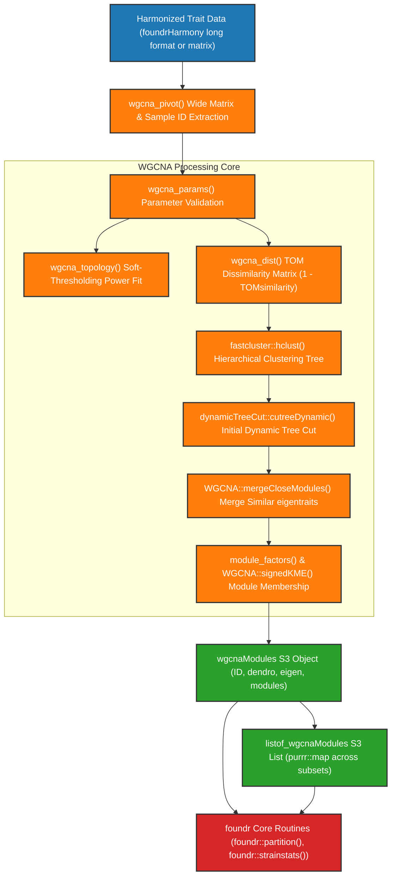

```{r, include = FALSE}
knitr::opts_chunk$set(
  collapse = TRUE,
  comment = "#>"
)
```

# modulr Developer Guide Overview & Architecture

## Package Purpose & Ecosystem Role

**modulr** (v0.3.1) is an R package within the `foundr` ecosystem providing Weighted Gene Co-expression Network Analysis (WGCNA) module creation, soft-thresholding topology analysis, topological overlap matrix (TOM) calculations, and eigentrait extraction for multiparent genetic cross data (specifically Collaborative Cross mouse studies).

- **Author:** Brian S. Yandell (<brian.yandell@wisc.edu>)
- **License:** GPL-3
- **Minimum R Version:** ≥ 3.5.0

Related packages in the ecosystem:

- **`foundrHarmony`**: Data ingestion, normalization (`nqrank()`), domain-specific spreadsheet parsers (`userHarmony`), and multi-dataset binding (`bind_traits()`).
- **`modulr`**: Standardizing WGCNA co-expression trait module creation, soft-thresholding topology estimation, TOM dissimilarity matrices, and eigentrait extraction.
- **`foundr`**: Core statistical analysis, linear model estimation, orthogonal variance partitioning (`partition()`), summary stats (`strainstats()`), S3 trait classes, and `ggplot2` visualizations.
- **`foundrShiny`**: Interactive Shiny web application providing modular UI components and reactive visual analysis panels.

---

## High-Level Package Architecture & Data Flow

The `modulr` package structures network module construction from harmonized long-format data frames or expression matrices into a clean pipeline:



---

## Developer Quick Start

### Local Development Workflow

To inspect, modify, or test `modulr` locally:

```r
# 1. Load local package sources dynamically
devtools::load_all()

# 2. Re-generate documentation & NAMESPACE
devtools::document()

# 3. Run package check
devtools::check(cran = FALSE, vignettes = FALSE)
```

---

## Developer Guide Navigation

This Developer Guide is organized into the following detailed sub-articles:

1. **[Developer Guide Overview & Architecture](index.html)**: High-level package introduction, ecosystem role, quick start commands, and top-level architecture flowchart.
2. **[Function Index & WGCNA Trait Module Breakdown](modules.html)**: Exhaustive breakdown of all package functions and technical specification for organizing WGCNA objects for `foundr`.
3. **[Data Pipeline & WGCNA Harmonization Methodology](data_flow.html)**: Technical specification of matrix pivoting, sample ID standardization, TOM distance calculation, dynamic tree cutting, and S3 class structures (`wgcnaModules`, `listof_wgcnaModules`).
